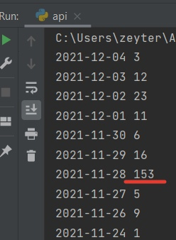
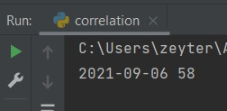

<h1>Александр Градский</h1>

Если промотреть весь список правок, то самое большое число изменений пришлось на дату смерти Градского. Это событие 
и вызвало такой большой всплеск.

<h1>Жан-Поль Бельмондо</h1>

Аналогично прошлому всплеску, правки связаны с датой смерти. Но нельзя точно полагаться на такую метрику, так как 
возможно могут быть более значимые события, которые перекроют количество правок.

