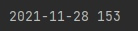
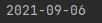

# API
## Александр Градский

Наибольшее число правок произошло в день смерти Александра Градского

## Жан-Поль Бельмондо

День, с наибольшим количесвтом изменений совпал с датой смерти. Но использование такой метрики нельзя, т.к большое число правок может быть вызвано каким-либо другим значим событием.