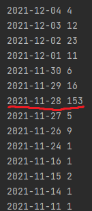
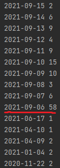

# API

Самое большое количество правок(153) совпадает с датой смерти
(28 ноября 2021) Александр Борисович Градского.

# Корреляция

Самое большое количество правок(58) совпадает с датой смерти
(6 сентября 2021) Жан-Поля Бельмондо.

Несмотря на совпадения большого кол-ва правок с датами смерти,
нельзя использовать такую метрику, так как у нас мало данных.
Если бы их было больше, то наверняка нашелся бы пример, в котором
отличается кол-во правок и дата смерти.