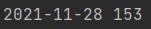
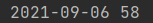

# API

## Александр Градский

Наибольшее число правок произошло в день смерти Александра Градского

## Жан-Поль Бельмондо

День, с наибольшим количеством правок, действительно совпал с датой смерти. Но использование такой метрики некорректно,
т.к. большое число правок может быть вызвано каким-либо другим значимым событием 