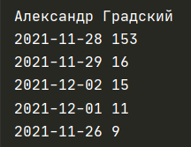
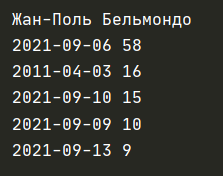

# Отчет

28 ноября 2021 года - дата сметри Градского и именна на эту дату приходится максимальное количество правок

Здесь так же можно заметить, что именно на дату смерти Бельмондо пришлось 
самое большое количество правок (6 сентября 2021 г.).
Конечно, это всего 2 примера, и не во всех случаях эта метрика будет работать.
