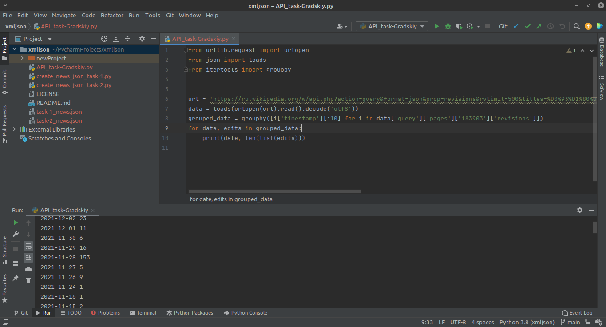
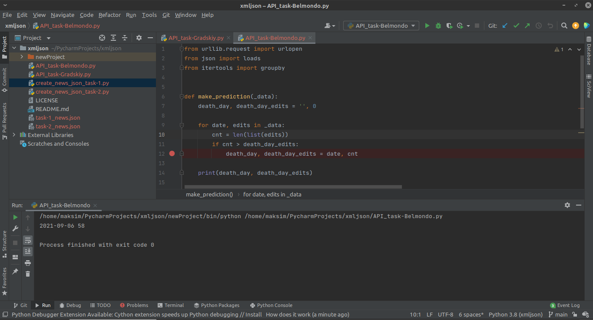
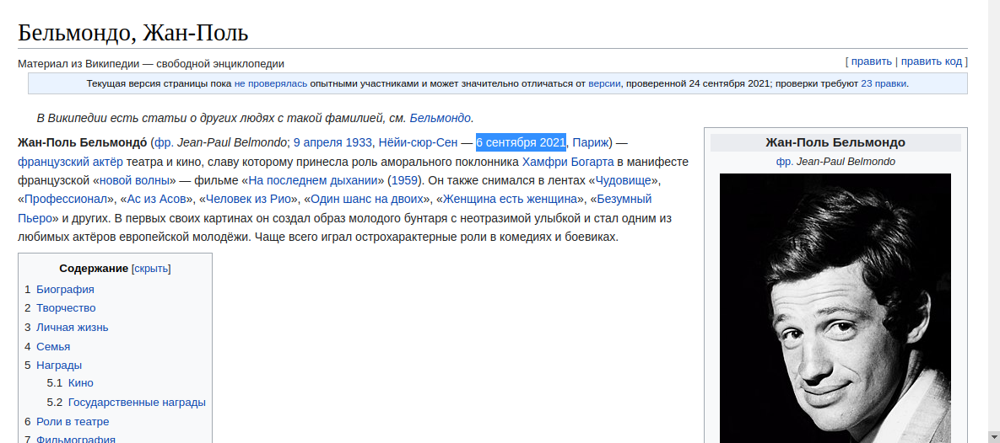

#Отчет

С созданием файлов .json вопросов не возникло, все было достаточно просто, так что думаю, описывать процесс не стоит.

____

С API тоже разобрался, вот скриншоты вывода программ:

Задание с Градским

Задание с Бельмондо. Предположение - Жан Поль умер 6 сентября 2021

Так и есть, в день его смерти на странице в Википедии было сделано больше всего правок (58)
