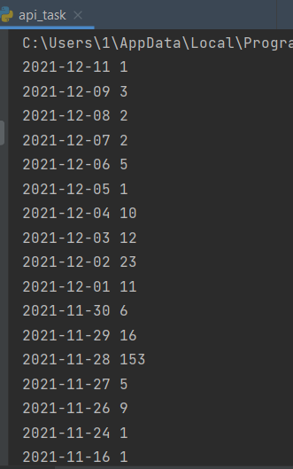
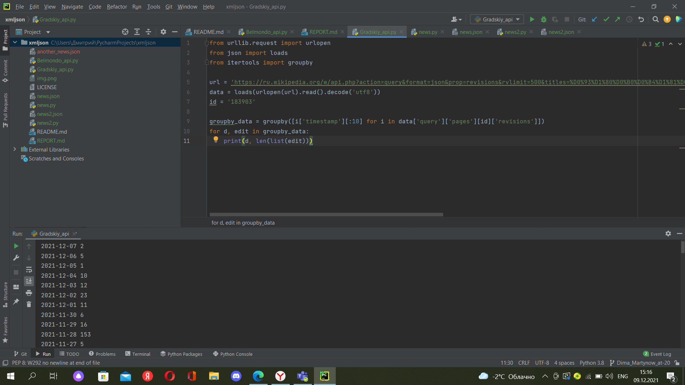

# API

28.11.2021 было наибольшее количество правок. Это дата смерти Градского.
# Корреляция

Наибольшее количество правок совпадает с датой смерти Бельмондо, но такой метрикой все же нельзя пользоваться. Так как, например, большое количество правок может быть вызвано другим событием.